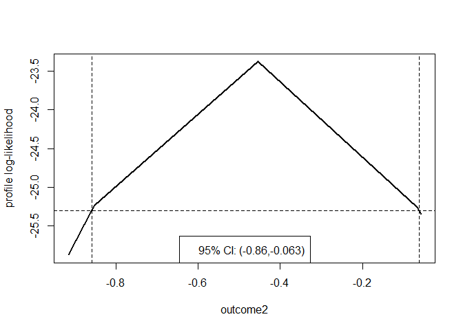
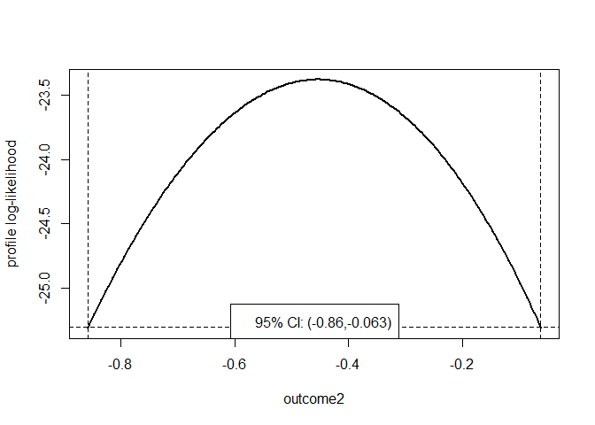

<!-- README.md is generated from README.Rmd. Please edit that file -->

# profileCI

[](https://github.com/paulnorthrop/profileCI/actions/workflows/R-CMD-check.yaml)
[](https://app.codecov.io/github/paulnorthrop/profileCI?branch=master)
[](https://cran.r-project.org/package=profileCI)
[](https://cran.r-project.org/package=profileCI)
[](https://cran.r-project.org/package=profileCI)

## Profiling a Log-likelihood to Calculate Confidence Intervals

This package computes confidence intervals based on profile
log-likelihood for one or more parameters in a user-supplied fitted
multi-parameter model. The functionality of the main function,
`profileCI()`, is like that of `confint.glm`, which calculates
confidence intervals for the parameters of a Generalised Linear Model
(GLM).

Speed of computation can be improved by starting the profiling from
limits based on large sample normal theory. The accuracy of the limits
can be set by the user. A plot method visualises the log-likelihood and
confidence interval. Cases where the profile log-likelihood flattens
above the value at which a confidence limit is defined can be handled,
leading to a limit at plus or minus infinity. Disjoint confidence
intervals will not be found.

## An example

We illustrate the use of `profileCI()` using an example from the help
file for `stats::glm()`.

``` r
## From example(glm)
counts <- c(18, 17, 15, 20, 10, 20, 25, 13, 12)
outcome <- gl(3, 1, 9)
treatment <- gl(3, 3)
glm.D93 <- glm(counts ~ outcome + treatment, family = poisson())
# Intervals based on profile log-likelihood
confint(glm.D93)
#> Waiting for profiling to be done...
#>                  2.5 %      97.5 %
#> (Intercept)  2.6958215  3.36655581
#> outcome2    -0.8577018 -0.06255840
#> outcome3    -0.6753696  0.08244089
#> treatment2  -0.3932548  0.39325483
#> treatment3  -0.3932548  0.39325483
```

To calculate these intervals using `profileCI` we provide a function
that calculates the log-likelihood for this Poisson GLM for an input
parameter vector `pars`.

``` r
poisson_loglik <- function(pars) {
  lambda <- exp(model.matrix(glm.D93) %*% pars)
  loglik <- stats::dpois(x = glm.D93$y, lambda = lambda, log = TRUE)
  return(sum(loglik))
}
```

The function `profileCI()` profiles the log-likelihood, with respect to
one parameter at a time. For a given value of this parameter the
log-likelihood is maximised over the other parameters. The aim is to
search below and above the MLE of the parameter until the profile
log-likelihood drops to a level corresponding to the limits of the
confidence interval of a desired confidence level.

Two arguments can be used to affect the speed with which the confidence
limits are obtained: `mult` determines the amount, as a percentage of
the estimated standard error of the estimator of the parameter of
interest, by which the value of the parameter is incremented when
profiling. Larger values of `mult` should result in a faster calculation
but increase the risk that one of the optimisations required will fail.
If the argument `faster = TRUE` then the searches for the lower and
upper confidence limits are started from limits based on the approximate
large sample normal distribution for the maximum likelihood estimator of
a parameter, rather than the maximum likelihood estimate. The defaults
are `mult = 32` and `faster = TRUE`.

``` r
library(profileCI)
prof <- profileCI(glm.D93, loglik = poisson_loglik)
prof
#>                   2.5%       97.5%
#> (Intercept)  2.6958271  3.36656379
#> outcome2    -0.8576884 -0.06255514
#> outcome3    -0.6753594  0.08244109
#> treatment2  -0.3932489  0.39324886
#> treatment3  -0.3932489  0.39324886
```

We can visualise the profile likelihood for a parameter using a plot
method.

``` r
plot(prof, parm = "outcome2")
```



To obtain smooth version of this plot, we call `profileCI()` with
`mult = 8` and `faster = FALSE`, but this is a much slower calculation.

``` r
prof <- profileCI(glm.D93, loglik = poisson_loglik, mult = 8, faster = FALSE)
plot(prof, parm = "outcome2")
```



By default, once it has been determined that a limit lies between two
values of the parameter, quadratic interpolation is used to estimate the
value of the limit. If a specific degree of accuracy is required then
this can be set by passing a positive tolerance `epsilon` to the `itp`
function in the [itp package](https://cran.r-project.org/package=itp).

An alternative to passing the log-likelihood function using the argument
`loglik` is to provide the same function via a `logLikFn` S3 method for
the fitted model object.

## Installation

To get the current released version from CRAN:

``` r
install.packages("profileCI")
```

To install the development version from GitHub:

``` r
remotes::install_github("paulnorthrop/profileCI")
```
